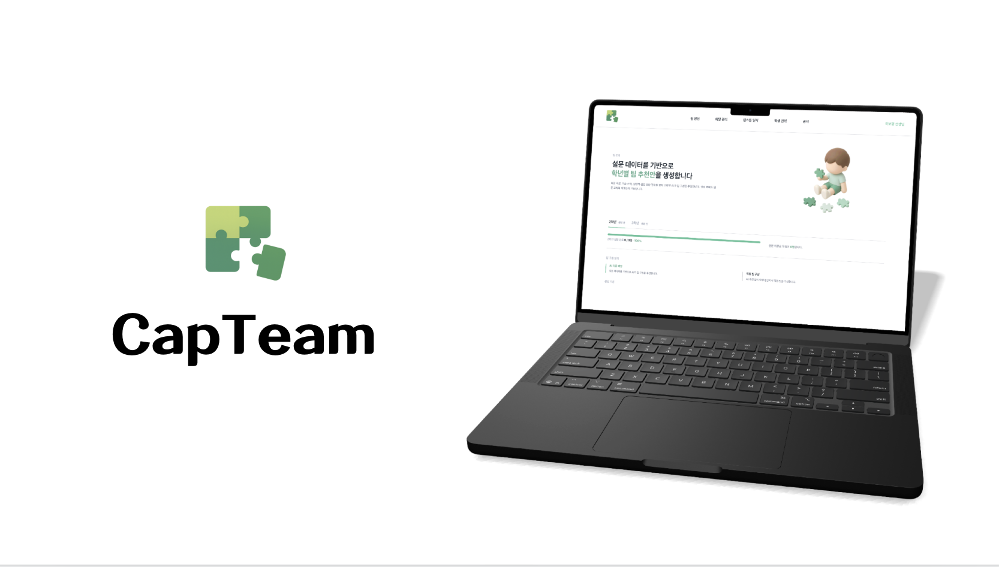

<picture>
  
</picture>

## 💡 프로젝트 소개
AI 기반 캡스톤 팀 자동생성 및 관리 올인원 서비스 **CapTeam**입니다.

CapTeam은 캡스톤 프로젝트에서 발생하는 팀 구성과 운영의 불편함을 줄이기 위해 기획된 서비스입니다.

학생 설문 데이터를 기반으로 AI가 팀 추천안을 생성하고, 관리자가 추천안을 검토/수정/승인한 뒤 공지, 채팅, 프로젝트 기획서, 캡스톤 일지까지 하나의 서비스에서 관리할 수 있도록 합니다.

## Member
**허재원** - Web · Design | 

**박진욱** - Back-End | 

**양원우** - Back-End | 

**김성현** - AI | 

**유채민** - AI | 
